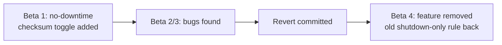

# PostgreSQL 19 Beta 4 — Data Checksums Online Revert (PoC)

One file. Copy-paste each block in order. No prior Postgres internals
knowledge needed.

---

## 1. What is a "data checksum"?

- A small stamp Postgres writes on every data page.
- Used to detect silent disk/storage corruption.
- Since PG 18, `initdb` turns this **on by default**.

## 2. What changed, in 3 lines

- **Old rule (PG 12–18):** you can only turn checksums on/off when Postgres
  is **fully stopped**.
- **PG 19 Beta 1–3 tried:** two commands to flip checksums on/off **while
  Postgres keeps running** — no downtime.
- **PG 19 Beta 4:** that no-downtime feature was **removed** (found risky
  during beta testing). Old rule is back.

## 3. Why should you care? (the benefit)

- If your runbook/automation assumed "no-downtime checksum toggle," it will
  **break** on Beta 4 / GA — good to know before you rely on it.
- Teaches a real skill: **proving** a database behavior with evidence,
  instead of trusting a changelog line blindly.
- Shows how PostgreSQL protects stability — a feature can be pulled this
  late if it looks unsafe.

## 4. What you need

- WSL2 Ubuntu
- Podman installed (rootful)
- Port `5432` free

---

## 5. One-time setup

```bash
mkdir -p ~/checksum-poc && cd ~/checksum-poc
```

## 6. Generate the test script

```bash
cat > run-test.sh << 'EOF'
#!/usr/bin/env bash
set -e

echo "### STEP 1: Start Postgres 19 Beta 4 ###"
podman rm -f pg19beta4 >/dev/null 2>&1 || true
podman volume create pg19beta4data >/dev/null 2>&1 || true
podman run -d --name pg19beta4 \
  -e POSTGRES_PASSWORD=postgres \
  -e PGDATA=/var/lib/postgresql/data/pgdata \
  -p 5432:5432 \
  -v pg19beta4data:/var/lib/postgresql/data \
  postgres:19beta4
sleep 5
podman exec pg19beta4 pg_isready -U postgres

echo ""
echo "### STEP 2: Confirm checksums are ON by default ###"
podman exec pg19beta4 psql -U postgres -Atc "SHOW data_checksums;"
echo "EXPECT: on"

echo ""
echo "### STEP 3: Try the REMOVED no-downtime commands (must fail) ###"
podman exec pg19beta4 psql -U postgres -c "SELECT pg_enable_data_checksums();" || true
echo "EXPECT: ERROR - function does not exist  (this proves the revert)"

echo ""
echo "### STEP 4: Try old tool WHILE RUNNING (must also fail) ###"
podman exec pg19beta4 pg_checksums --pgdata=/var/lib/postgresql/data/pgdata --disable || true
echo "EXPECT: error - cluster must be shut down"

echo ""
echo "### STEP 5: Stop Postgres, then use the old tool (must SUCCEED) ###"
podman stop pg19beta4
podman run --rm -v pg19beta4data:/var/lib/postgresql/data \
  --entrypoint pg_checksums postgres:19beta4 \
  --pgdata=/var/lib/postgresql/data/pgdata --disable
podman run --rm -v pg19beta4data:/var/lib/postgresql/data \
  --entrypoint pg_checksums postgres:19beta4 \
  --pgdata=/var/lib/postgresql/data/pgdata --enable
echo "EXPECT: both commands succeed - this is the ONLY working method"

echo ""
echo "### STEP 6: Restart and confirm cluster is healthy ###"
podman start pg19beta4
sleep 3
podman exec pg19beta4 psql -U postgres -Atc "SHOW data_checksums;"
echo "EXPECT: on"
echo ""
echo "### DONE ###"
EOF
chmod +x run-test.sh
```

## 7. Run it

```bash
./run-test.sh
```

## 8. How to read the output — one line per result

| You see | What it really means | Pass? |
|---|---|---|
| `on` (Step 2) | Checksums were on from the start | ✅ Expected |
| `ERROR: function ... does not exist` (Step 3) | The no-downtime commands are gone | ✅ **This is the proof of the revert** |
| `error: cluster must be shut down` (Step 4) | Old tool still refuses to run live | ✅ Expected — no online path exists |
| `Checksums disabled/enabled in cluster` (Step 5) | Old tool worked because Postgres was stopped | ✅ Expected |
| `on` (Step 6) | Cluster restarted, checksums restored | ✅ Expected |

> **Note:** the `ERROR` lines are not bugs. They are the whole
> point — we are *trying* things that Beta 4 removed, so seeing them fail
> is a "test passed," not a "test crashed."

---

## 9. Generate the cleanup script

```bash
cat > cleanup.sh << 'EOF'
#!/usr/bin/env bash
podman rm -f pg19beta4 >/dev/null 2>&1 || true
podman volume rm pg19beta4data >/dev/null 2>&1 || true
podman rmi -f postgres:19beta4 >/dev/null 2>&1 || true
echo "Cleaned up: container, volume, image all removed."
EOF
chmod +x cleanup.sh
```

## 10. Clean everything up

```bash
./cleanup.sh
```

---

## 11. The change, in one picture



## 12. Cheat sheet

- Check checksum state: `podman exec pg19beta4 psql -U postgres -Atc "SHOW data_checksums;"`
- Try the removed command: `SELECT pg_enable_data_checksums();` → expect error
- Toggle offline: stop container → run `pg_checksums --disable` / `--enable` → start container
- Full cleanup: `./cleanup.sh`

## 13. Troubleshooting

| Problem | Cause | Fix |
|---|---|---|
| `port 5432 already in use` | Something else is using it | Stop it, or change `-p 5432:5432` to `-p 5433:5432` |
| Pull is slow/fails | No internet from WSL2 | Check `podman info`, retry |
| Step 2 doesn't print `on` | Old image cached | `podman rmi -f postgres:19beta4` then re-run |
| Script exits early on the *expected* errors | `set -e` in older shells can be strict | Script already handles this with `|| true` — re-copy the block exactly |
